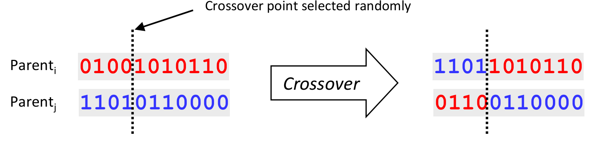

# sNNake

Evolving **neural networks** using **genetic algorithm**.

## Build and Libraries

<table align="center">
<tr>
<td style="text-align:center"><b>master</td>
<td></td>
</tr>
<tr>
<td style="text-align:center"><b>dev</td>
<td></td>
</tr>
</table>

&NewLine;

## Description

**sNNake** is the final exam project I wrote for the course of Data Analysis for Applied Physics and corrected and improved for the course Software and Computing for Applied Physics.

The project consists in creating the popular game **snake** and adding a **neural network** to play it. This network is then evolved using a **genetic algorithm** to play better at each iteration.

#### Snake

The game is the simple snake, in which a snake has to move in a restricted space, trying to eat as much food as possible without eating himself or exiting the field. The snake can see in three directions (left, front, and right) and knows the distance from the food and the angle between the direction of its movement and the direction of the food.

This information is passed to a neural network, which then decides if it is necessary to change direction (to avoid collision with walls or the body) or to continue in that direction.

#### Neural network

A neural network is a mathematical-computational model which is composed of various layers of sub-elements called _perceptrons_. Each of these perceptrons computes a non-linear weighted sum of inputs and returns an output which can be connected to the following layer.

In the project, a list of neural networks are initialized with random weights in interval [-1, 1] and then their performance is measured by making them play the game. The list is then evolved using the genetic algorithm to achieve better results.

#### Genetic Algorithm

The genetic algorithm is an optimization technique based upon the idea of biological evolution. Starting from a population of individuals with random characteristics (in this case the weights of the neural network), a _fitness_ function (the amount of food eaten) is determined for each individual, and those with a higher score are more likely to reproduce.

From two selected individuals, a combination of their characteristics is obtained through _crossover_ and _mutation_ processes. The first  one simply swap the weights of the two networks while the second randomly changes only one weight.

## Installation
Since the project is not a package, the only way to install it is by download or cloning it, via the proper button or the command line (if **git** is installed):

	git clone https://github.com/tommaso1311/sNNake
	
## Usage

I had a lot of fun writing and testing the base game, so I thought the possibility to play it without caring about the model should be included. Apart from this there is the option to simply train a new model or to load an existing one (to both retrain or assess its performance).

There are a lot of options with which to run the program to better customize the model, to see a complete list of them run:

	python main.py --help

#### Playing the base game

To play a normal game simply run:

	python main.py --play
	
#### Training a new model

To train a new model run the command:

	python main.py --train
	
but if you think this may be too simple, run:

	python main.py --train -g 100 -k 80 -n 25 10 -e 1000 -m "name_of_the_model"
	
as this would create a model of 100 generations of 80 snakes each, with a maximum game duration of 1000 steps and a neural network with two hidden layers on 25 and 10 perceptrons respectively and saves it with a specified name.

#### Loading an existing model

To load an existing model run the command:

	python main.py --load

and simply follow the instructions.
If you want to load a specific model, simply use the flag -m as in the previous example:

	python main.py --load -m "name_of_the_model"